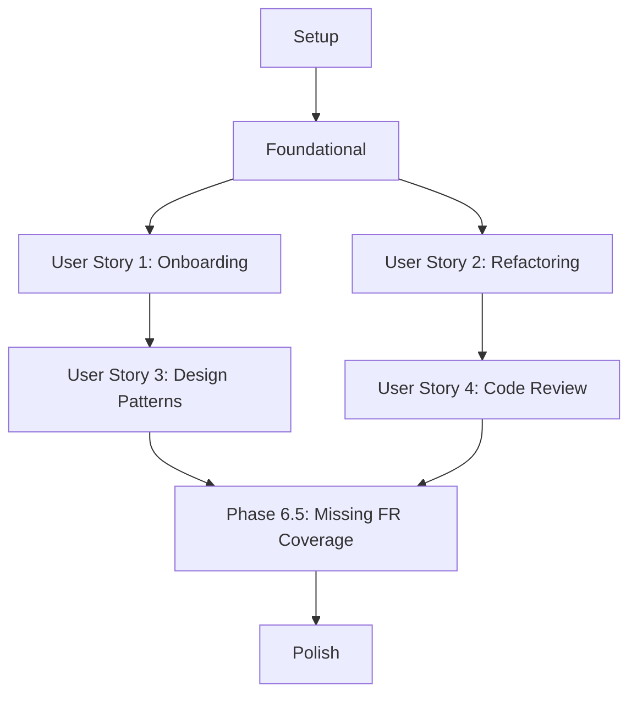

# Implementation Tasks: Enhance Rust Modular Design Documentation

## Project Context

**Feature**: Enhance Rust Modular Design Documentation
**Branch**: 002-modular-design-docs
**Primary Goal**: Expand RUST_MODULAR_DESIGN.md with comprehensive architectural guidance

## Dependencies

## Implementation Strategy

MVP Scope: User Story 1 (New Developer Onboarding)
Incremental Delivery: Expand documentation in phases, focusing on clarity and practical examples

## Phases

### Phase 1: Setup

- [X] T001 Create documentation project structure in specs/002-modular-design-docs/
- [X] T002 Initialize RUST_MODULAR_DESIGN.md with basic template
- [X] T003 Set up version control tracking for documentation

### Phase 2: Foundational

- [X] T004 Extract existing modular design patterns from current codebase
- [X] T005 Define consistent terminology for architectural concepts
- [X] T006 Create initial layer definition guidelines
- [X] T034 [Constitution] Map Chinese constitution principles to English documentation sections with explicit cross-references

### Phase 3: User Story 1 - New Developer Onboarding [US1]

- [ ] T007 [US1] Draft layer classification decision tree in RUST_MODULAR_DESIGN.md
- [ ] T008 [US1] Create code examples for db/model/codec/reader layer placement
- [ ] T009 [US1] Develop 15-minute comprehension quiz template
- [ ] T010 [P] [US1] Add visual diagrams for layer responsibilities
- [ ] T011 [US1] Write step-by-step guide for placing new structs in correct layer

### Phase 4: User Story 2 - Refactoring Guidance [US2]

- [ ] T012 [US2] Document trait abstraction pattern for breaking circular dependencies
- [ ] T013 [US2] Create refactoring guide for replacing glob imports
- [ ] T014 [US2] Develop error boundary conversion examples
- [ ] T015 [P] [US2] Add 3-violation refactoring exercise with solutions

### Phase 5: User Story 3 - Design Pattern Selection [US3]

- [ ] T016 [US3] Expand existing Builder pattern documentation
- [ ] T017 [US3] Add comprehensive NewType pattern guide
- [ ] T018 [US3] Create Trait-First design pattern documentation
- [ ] T019 [P] [US3] Develop design pattern selection decision flowchart

### Phase 6: User Story 4 - Code Review Reference [US4]

- [ ] T020 [US4] Create 10-item architectural compliance checklist
- [ ] T021 [US4] Document dependency direction validation rules
- [ ] T022 [US4] Develop error type and API design review guidelines
- [ ] T023 [P] [US4] Add mock pull request examples with annotations

### Phase 6.5: Missing Functional Requirements Coverage

- [X] T028 [FR-007] Create module templates with mod.rs structure and visibility patterns (2 complete examples)
- [X] T029 [FR-008] Document dependency injection strategies for Rust ownership model (3 working code examples)
- [X] T030 [FR-010] Add integration test examples for modular code testability (2 complete test examples)
- [X] T031 [FR-011] Document zero-cost abstraction trade-offs with decision criteria (3 scenarios)
- [X] T032 [FR-012] Add performance considerations for trait dispatch with benchmarks (2 comparison examples)
- [X] T033 [FR-006] Complete refactoring patterns for 5th violation (visibility leaks)
- [X] T035 [Constitution] Include test-first workflow examples demonstrating red-green-refactor cycle for modular Rust code

### Phase 7: Polish & Cross-Cutting Concerns

- [ ] T024 Conduct internal documentation review
- [ ] T025 Create documentation readability and comprehension quiz
- [ ] T026 Update project README to reference new documentation
- [ ] T027 Prepare documentation update process guidelines

## Parallel Execution Opportunities

1. Foundational and constitution mapping (T004, T005, T006, T034)
2. Layer documentation (T007, T010)
3. Design pattern guides (T016, T017, T018)
4. Refactoring examples (T012, T013, T014, T033)
5. Missing FR coverage (T028, T029, T030, T031, T032, T035)

## Success Criteria Validation

- Verify 15-minute comprehension time
- Confirm 85% accuracy in layer classification
- Validate documentation helpfulness through team survey
- Measure reduction in architectural clarification questions

## Independent Test Criteria

Each user story has an independent test as specified in the original feature specification, ensuring incremental validation of documentation improvements.