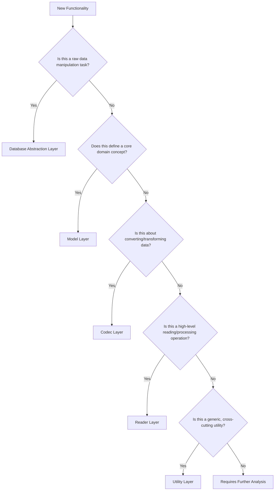

# Rust Modular Design Guidelines for erc-mdbx-index

## Introduction

This document provides comprehensive guidelines for modular design in the erc-mdbx-index project, focusing on architectural principles, design patterns, and best practices for Rust development.

## Table of Contents

1. [Layer Definitions](modular-design/layer-definitions.md)
2. [Design Patterns](modular-design/design-patterns.md)
3. [Refactoring Guide](modular-design/refactoring-guide.md)
4. [Architectural Rules](modular-design/architectural-rules.md)

## Core Design Principles

### 1. Single Responsibility
- Each module focuses on a single, well-defined functionality
- Clear separation of concerns across layers
- Minimal, focused public APIs

### 2. Explicit Dependencies
- Use explicit `use` statements
- Avoid glob imports (`use xxx::*`)
- Define dependencies through traits
- Follow strict layer dependency rules

### 3. Interface Segregation
- Use traits to define abstract interfaces
- Separate interface from implementation
- Support dependency injection for testing
- Minimize public surface area

### 4. Error Boundaries
- Define module-specific error types
- Convert errors at module boundaries
- Use `thiserror` for comprehensive error handling
- Provide context-rich error messages

### 5. Testability
- Design modules to support unit testing
- Use dependency injection
- Create mock implementations
- Provide test fixtures and helpers

## Layer Classification Decision Tree

### 📊 Layer Placement Decision Flow

### 🔍 Detailed Decision Criteria

#### Database Abstraction Layer (DAL)
- **When to Use**:
  - Direct database connection management
  - Transaction handling
  - Low-level cursor operations
  - MDBX environment configuration

- **Key Questions**:
  1. Does the code interact directly with database primitives?
  2. Is it managing database connections or transactions?
  3. Does it handle raw byte-level data retrieval?

#### Model Layer
- **When to Use**:
  - Defining domain entities
  - Implementing business logic constraints
  - Creating type-safe representations of domain concepts

- **Key Questions**:
  1. Does this represent a core business concept?
  2. Does it have validation rules or invariants?
  3. Is it a self-contained data structure?

#### Codec Layer
- **When to Use**:
  - Data encoding/decoding
  - RLP transformation
  - Serialization/deserialization
  - Binary data conversion

- **Key Questions**:
  1. Does the code transform data between formats?
  2. Is it handling RLP or other encoding mechanisms?
  3. Does it convert between binary and structured representations?

#### Reader Layer
- **When to Use**:
  - Complex state reading operations
  - Coordinating between database and model layers
  - Implementing domain-specific reading logic
  - Aggregating or processing data

- **Key Questions**:
  1. Does it combine multiple layers to produce a result?
  2. Is it implementing complex reading strategies?
  3. Does it provide high-level, meaningful operations?

#### Utility Layer
- **When to Use**:
  - Configuration management
  - Signal processing
  - Generic helper functions
  - Cross-cutting concerns

- **Key Questions**:
  1. Is the functionality used across multiple layers?
  2. Does it not fit into a specific domain layer?
  3. Is it a generic, reusable utility?

### 🚨 Red Flags & Warning Signs

- **Circular Dependencies**: Indicates incorrect layer placement
- **Complex Constructors**: Suggests over-complicated design
- **Large Public API**: Hints at potential responsibility overflow
- **Multiple Responsibility Indicators**: Time to refactor

### 💡 Decision Support

1. **Prefer Composition**: Break complex functionality into smaller, focused modules
2. **Minimize Layer Dependencies**: Each layer should be as independent as possible
3. **Use Traits for Abstraction**: Define clear interfaces between layers
4. **Document Architectural Decisions**: Explain why a module is placed in a specific layer

## Key Artifacts

- Detailed layer definitions
- Comprehensive design pattern catalog
- Refactoring guidelines
- Architectural compliance checklist

## Contribution Guidelines

1. Follow modular design principles
2. Maintain clear, minimal public APIs
3. Write comprehensive unit tests
4. Document architectural decisions
5. Use traits for abstractions
6. Minimize runtime overhead

## Version

**Current Version**: 1.0.0
**Last Updated**: 2025-12-05