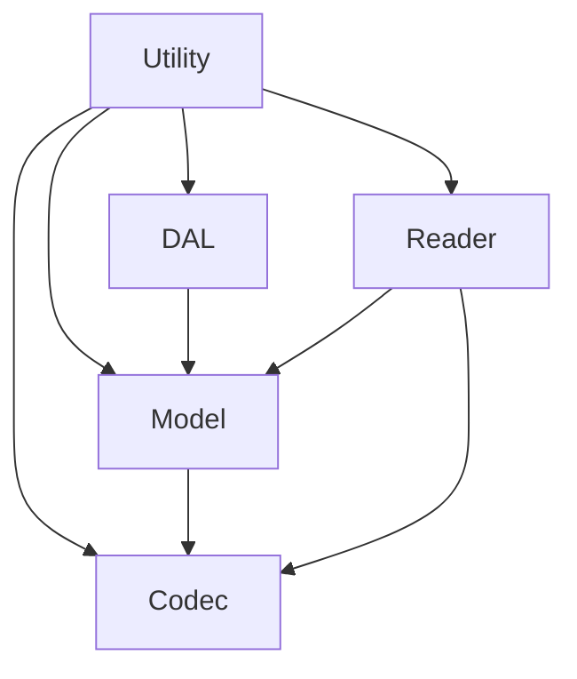

# Dependency Direction Validation Rules

## Purpose
These rules ensure that modules only depend in the correct direction—higher layers may depend on lower layers, but never the reverse, enforcing strict architectural boundaries and maintainability.

## Layer Dependency Principles
- DAL/Database Layer: Must not depend on Model, Reader, Codec, or Utility layers. Only exposes data interfaces.
- Model Layer: May depend on DAL, but not on Reader, Codec, or Utility. Contains domain types.
- Codec Layer: May depend on Model, but not on DAL or Reader.
- Reader Layer: May depend on Model/Codec, but not DAL directly. Handles I/O logic.
- Utility Layer: Shared helpers; must not import any project-specific layers (DAL, Model, Codec, Reader).

## Code Example
```rust
// Correct: Reader layer depends on Model
use crate::model::Account;

// Incorrect: DAL importing Model (violates rule)
use crate::model::Account; // 🚫 Should not happen in DAL code
```

## Validation Strategies
- Clippy or custom linter rules enforcing imports
- Code review checklist requiring justification for each cross-layer dependency
- Automated scan: Grep for illegal imports at CI

## Decision Tree


## Compliance
- All layer imports validated before PR merge
- Violations must be refactored; exceptions require architectural review

## References
- See `/src/docs/modular-design/layer-definitions.md` and `/src/docs/modular-design/architectural-compliance-checklist.md` for foundational rules.