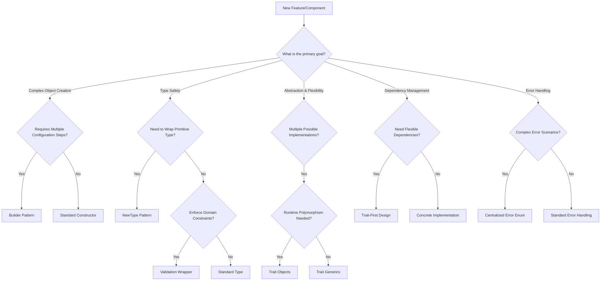
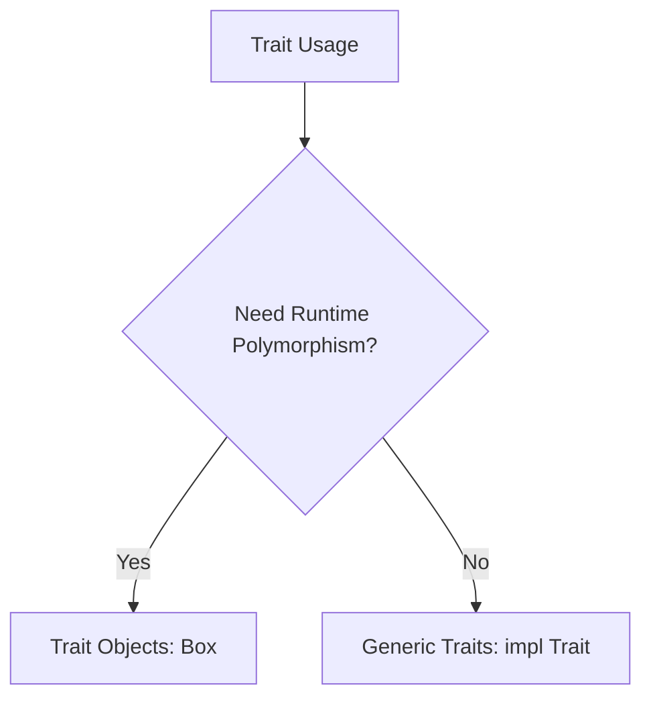

# Design Pattern Selection Guide

## Overview

Choosing the right design pattern is crucial for creating maintainable, performant, and clean Rust code. This guide provides a systematic approach to pattern selection.

## Decision Flowcharts

### 🌳 Comprehensive Design Pattern Selection Flowchart



## Pattern Selection Guide

### 1. Builder Pattern

**When to Use**:
- Complex object with many optional parameters
- Configuration-heavy objects
- Need to enforce validation during construction

**Example Use Cases**:
- Database configuration
- Complex state initialization
- Objects with multiple optional fields

```rust
pub struct DatabaseConfigBuilder {
    path: Option<PathBuf>,
    max_dbs: u32,
    read_only: bool,
}

impl DatabaseConfigBuilder {
    pub fn new() -> Self {
        Self {
            path: None,
            max_dbs: 10,
            read_only: true,
        }
    }

    pub fn path(mut self, path: PathBuf) -> Self {
        self.path = Some(path);
        self
    }

    pub fn build(self) -> Result<DatabaseConfig> {
        Ok(DatabaseConfig {
            path: self.path.ok_or(ConfigError::MissingPath)?,
            max_dbs: self.max_dbs,
            read_only: self.read_only,
        })
    }
}
```

### 2. NewType Pattern

**When to Use**:
- Add type safety to primitives
- Prevent incorrect type usage
- Add domain-specific semantics

**Example Use Cases**:
- Ethereum addresses
- Account nonces
- Monetary amounts
- Cryptographic keys

```rust
#[derive(Debug, Clone, Copy, PartialEq, Eq)]
pub struct Address([u8; 20]);

impl Address {
    pub fn from_slice(slice: &[u8]) -> Result<Self> {
        if slice.len() != 20 {
            return Err(AddressError::InvalidLength);
        }
        let mut addr = [0u8; 20];
        addr.copy_from_slice(&slice[..20]);
        Ok(Self(addr))
    }
}
```

### 3. Trait-First Design

**When to Use**:
- Multiple potential implementations
- Need for dependency injection
- Want to decouple interface from implementation

**Example Use Cases**:
- Database backends
- Codec strategies
- Mocking for testing

```rust
pub trait AccountReader {
    fn get_account(&self, address: Address) -> Result<Option<PlainAccount>>;
    fn list_accounts(&self) -> Result<Vec<PlainAccount>>;
}

pub struct MdbxAccountReader {
    db: MdbxDatabase,
}

impl AccountReader for MdbxAccountReader {
    fn get_account(&self, address: Address) -> Result<Option<PlainAccount>> {
        // MDBX-specific implementation
    }
}
```

### 4. Trait Object vs Generic Trait



#### Trait Objects (Dynamic Dispatch)
- Runtime polymorphism
- Performance overhead
- Useful for plugin systems

```rust
pub struct FlexibleDatabase {
    backend: Box<dyn DatabaseBackend>,
}
```

#### Generic Traits (Static Dispatch)
- Compile-time optimization
- Zero-cost abstraction
- Preferred for performance-critical code

```rust
pub fn process_accounts<R: AccountReader>(reader: &R) {
    // Compile-time method resolution
}
```

### 5. Error Handling Patterns

**Centralized Error Enum**:
- Comprehensive error tracking
- Context preservation
- Easy error conversion

```rust
#[derive(Debug, thiserror::Error)]
pub enum Error {
    #[error("Database error: {0}")]
    Db(#[from] DatabaseError),

    #[error("Codec error: {0}")]
    Codec(#[from] CodecError),
}
```

## Decision Support Matrix

| Scenario | Recommended Pattern | Rationale |
|----------|---------------------|-----------|
| Configuration Heavy | Builder | Flexible, validatable construction |
| Primitive Type Wrapping | NewType | Type safety, semantic meaning |
| Multiple Implementations | Trait-First | Decoupling, flexibility |
| Performance Critical | Generic Traits | Zero-cost abstraction |
| Complex Error Scenarios | Centralized Error Enum | Comprehensive error management |

## Anti-Patterns to Avoid

- Overusing design patterns
- Creating unnecessary abstractions
- Ignoring performance implications
- Complex trait hierarchies
- Premature generalization

## Performance Considerations

- Static dispatch preferred
- Minimize dynamic trait objects
- Use `#[inline]` judiciously
- Benchmark complex abstractions

## Testing Strategies

- Use traits for mocking
- Test multiple implementations
- Validate pattern-specific behaviors
- Ensure zero-overhead abstractions

## Version

**Current Version**: 1.0.0
**Last Updated**: 2025-12-05