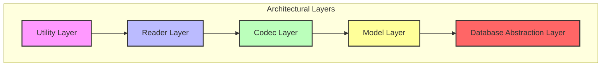
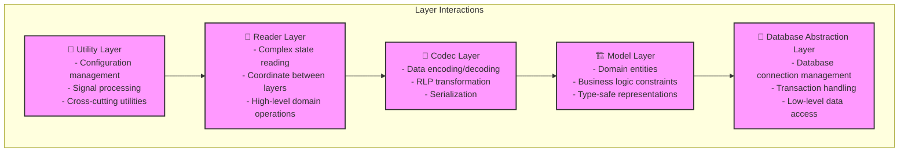
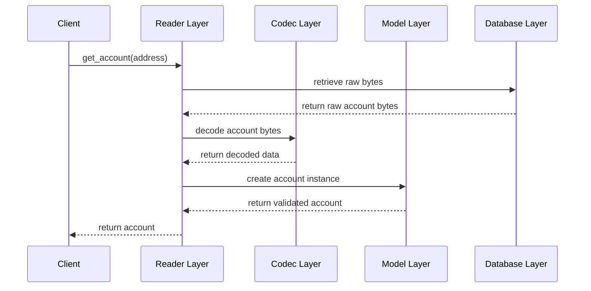
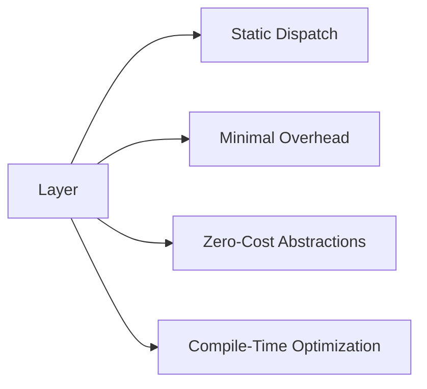
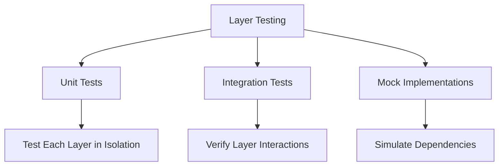
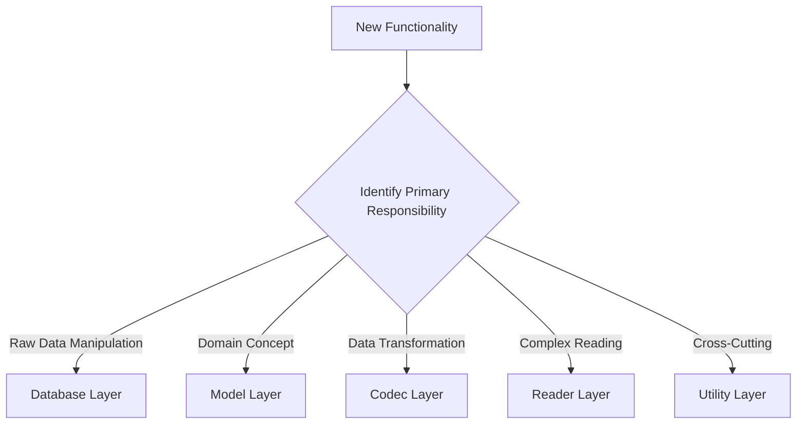

# Layer Responsibilities Visualization

## Overview

This document provides visual and textual representations of the architectural layers in the erc-mdbx-index project.

## Dependency Flow Diagram

## Layer Responsibilities Detailed Diagram

## Data Flow Example

## Layer Interaction Patterns

### 1. Unidirectional Dependency
- Higher layers can depend on lower layers
- Lower layers CANNOT depend on higher layers
- Each layer has a minimal, well-defined interface

### 2. Trait-Based Abstraction
- Traits define interfaces between layers
- Enable dependency injection
- Support mock implementations for testing

### 3. Error Conversion
- Each layer can convert errors to its domain-specific error type
- Errors are converted at layer boundaries
- Maintain context while simplifying error handling

## Performance Characteristics

## Testing Strategies

## Architectural Decision Flowchart

## Guidelines

1. Respect layer boundaries
2. Use traits for abstraction
3. Minimize dependencies
4. Provide clear error handling
5. Design for testability

## Version

**Current Version**: 1.0.0
**Last Updated**: 2025-12-05