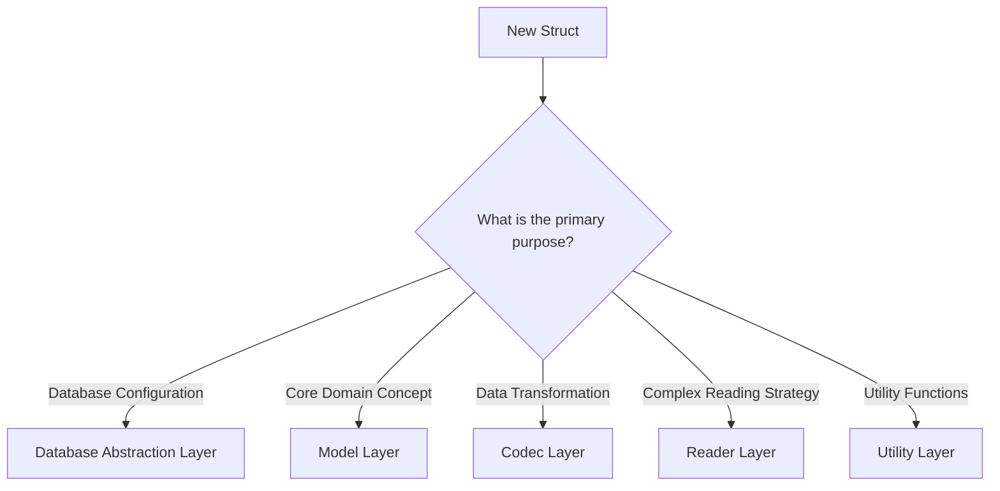
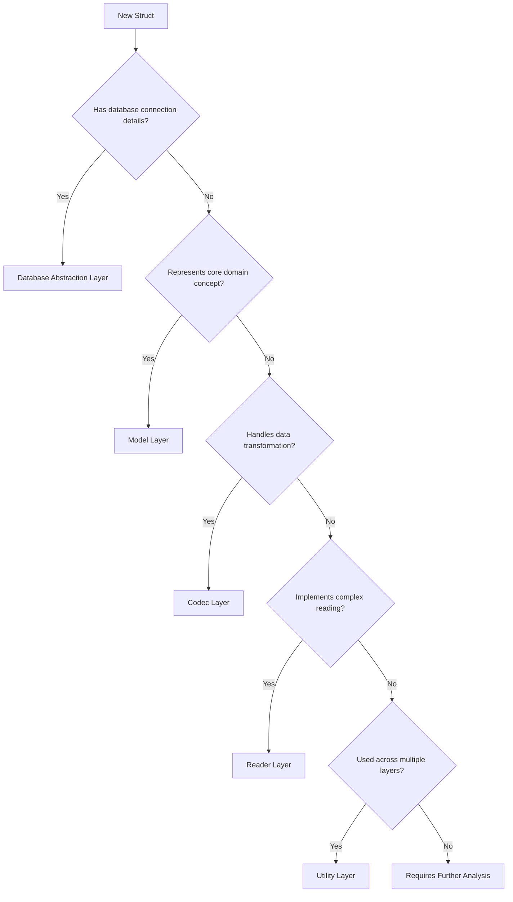

# Struct Placement Guide for erc-mdbx-index

## Overview

This guide provides a systematic approach to deciding where to place new structs in the project's layered architecture.

## Decision Flowchart



## Detailed Placement Guide

### 1. Database Abstraction Layer (DAL)

**When to Place a Struct Here**:
- Represents database configuration
- Manages database connections
- Handles low-level database primitives

**Checklist**:
- [ ] Directly related to database connection
- [ ] Manages transaction or cursor operations
- [ ] No business logic or domain semantics

**Example Structs**:
- `DatabaseConfig`
- `ReadTransaction`
- `DatabaseEnvironment`

**Code Example**:
```rust
// ✅ Correct DAL Struct
pub struct MdbxReadTransaction<'env> {
    inner: libmdbx::Transaction<'env, RO>,
    max_readers: u32,
}
```

### 2. Model Layer

**When to Place a Struct Here**:
- Represents core domain concepts
- Contains business logic constraints
- Provides type-safe domain representations

**Checklist**:
- [ ] Represents a core business entity
- [ ] Contains validation logic
- [ ] No direct database or encoding details
- [ ] Defines domain-specific behavior

**Example Structs**:
- `PlainAccount`
- `Address`
- `StorageKey`

**Code Example**:
```rust
// ✅ Correct Model Layer Struct
pub struct PlainAccount {
    address: Address,
    nonce: u64,
    balance: U256,

    pub fn validate_balance(&self) -> Result<()> {
        if self.balance > MAX_ALLOWED_BALANCE {
            Err(ModelError::BalanceExceeded)
        } else {
            Ok(())
        }
    }
}
```

### 3. Codec Layer

**When to Place a Struct Here**:
- Handles data transformation
- Manages encoding/decoding logic
- Converts between different representations

**Checklist**:
- [ ] Transforms data between formats
- [ ] Handles serialization/deserialization
- [ ] No business logic or storage details
- [ ] Focuses on data conversion

**Example Structs**:
- `RlpAccountEncoder`
- `JsonAccountTransformer`
- `DataConverter`

**Code Example**:
```rust
// ✅ Correct Codec Layer Struct
pub struct RlpAccountEncoder {
    encoding_version: u8,
}

impl RlpAccountEncoder {
    pub fn encode(&self, account: &PlainAccount) -> Vec<u8> {
        rlp::encode(&(
            account.nonce,
            account.balance,
            account.storage_root,
            account.code_hash
        ))
    }
}
```

### 4. Reader Layer

**When to Place a Struct Here**:
- Implements complex reading strategies
- Coordinates between layers
- Provides high-level domain operations

**Checklist**:
- [ ] Combines multiple layers' functionality
- [ ] Provides meaningful, high-level operations
- [ ] Implements domain-specific reading logic
- [ ] No low-level database details

**Example Structs**:
- `StateReader`
- `AccountIterator`
- `HistoricalStateReader`

**Code Example**:
```rust
// ✅ Correct Reader Layer Struct
pub struct StateReader<D: Database, C: AccountCodec> {
    db: D,
    codec: C,
}

impl<D: Database, C: AccountCodec> StateReader<D, C> {
    pub fn get_account_history(&self, address: Address) -> Result<Vec<PlainAccount>> {
        // Complex reading strategy across layers
    }
}
```

### 5. Utility Layer

**When to Place a Struct Here**:
- Provides cross-cutting utilities
- Manages configuration
- Handles generic helper functions

**Checklist**:
- [ ] Used across multiple layers
- [ ] No specific domain logic
- [ ] Generic and reusable
- [ ] Supports infrastructure concerns

**Example Structs**:
- `ConfigManager`
- `SignalHandler`
- `LoggingContext`

**Code Example**:
```rust
// ✅ Correct Utility Layer Struct
pub struct ConfigManager {
    base_path: PathBuf,
    max_db_readers: u32,
}

impl ConfigManager {
    pub fn load_config(&self) -> Result<DatabaseConfig> {
        // Generic configuration loading logic
    }
}
```

## Common Antipatterns to Avoid

### ❌ Incorrect Struct Placement

```rust
// Bad Example: Business logic in DAL
pub struct DatabaseTransaction {
    fn validate_account_balance(&self) -> Result<()> {
        // ❌ Business logic does NOT belong in Database Layer
    }
}

// Bad Example: Database details in Model
pub struct Account {
    raw_bytes: Vec<u8>,  // ❌ Raw database bytes do NOT belong in Model Layer
}
```

## Decision Support Flowchart



## Verification Checklist

- [ ] Struct follows single responsibility principle
- [ ] Minimal dependencies between layers
- [ ] Clear, focused purpose
- [ ] Supports testing and mockability
- [ ] Follows Rust's type system best practices

## Version

**Current Version**: 1.0.0
**Last Updated**: 2025-12-05